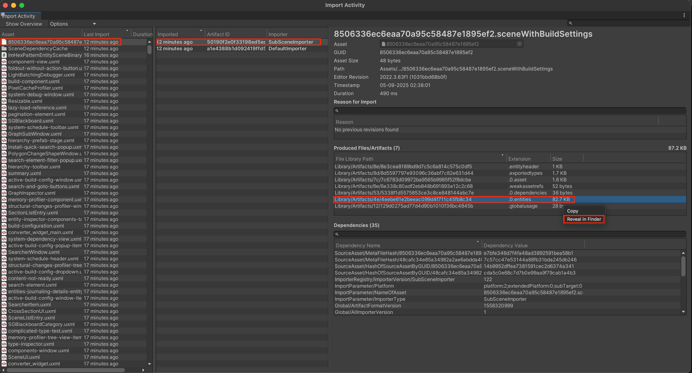
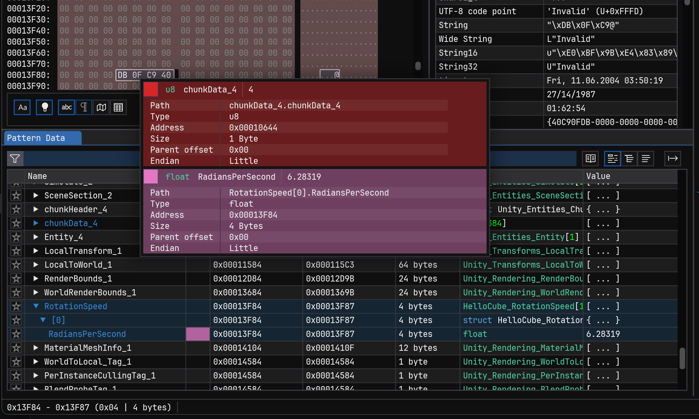

# Binary debugging

The output data of various [baking](baking-overview.md) systems is optimized for runtime usage. This data is stored inside binary files located in the **[Project root folder]/Library/Artifacts** folder.

You can use the contents of these binary files for debugging purposes. This section demonstrates how to see what has changed between baking operations by comparing two such files.

## Prerequisites

* Download and install the [ImHex](https://imhex.werwolv.net/) binary editor. **Note**: ImHex is not supported or developed by Unity. 

* Add the following scripting define symbol to the Unity project: `UNITY_DOTS_IMHEX`. For information on how to do that, refer to the [Custom scripting symbols](https://docs.unity3d.com/Manual/custom-scripting-symbols.html#player-settings) page.

## Inspect a subscene

To inspect the binary artifacts of a subscene, follow these steps:

1. Open a subscene you intend to inspect to trigger the baking operation.

2. Once the baking has completed, the console should display a message similar to this:

    ```
    Created an .hexpat file from the recent bake, located at: ./Library/GeneratedImHex/45a2c8428b97e4e48955d9b5114509fe.0.entities.hexpat (Size: 24154 bytes)
    ```
    
    The `.hexpat` file is a pattern file describing types of data and their locations in a binary file.

3. In the **Project** window, open the **SceneDependencyCache** folder, right-click on one of the files in the folder and select **View in Import Activity window**.

4. In the **Import Activity** window, select **Options** > **Show previous imports**.

5. Sort the import activities by **Last Import**. The most recent import should be the subscene you just opened.

6. Select the entry which was imported by the **SubSceneImporter** process. In the right part of the **Import Activity** window, you should now see the **Produced Files/Artifacts** section. 

7. Right click on an entry with the extension **.0.entities** and select **Show in Explorer** (Windows) or **Reveal in Finder** (MacOS). The selected file is the binary data file of the subscene.

    

8. Open the **ImHex** editor and drag the binary file into it. The editor displays the binary contents of the file.

    

9. Navigate to the **Library/GeneratedImHex** folder. Select the `.hexpat` file with `.0.entities` in the name, and drag and drop it onto the ImHex editor.

10. In ImHex, in the bottom-center part of the window, press the **Play** button . The editor loads the meta data and you can inspect the binary data.

    